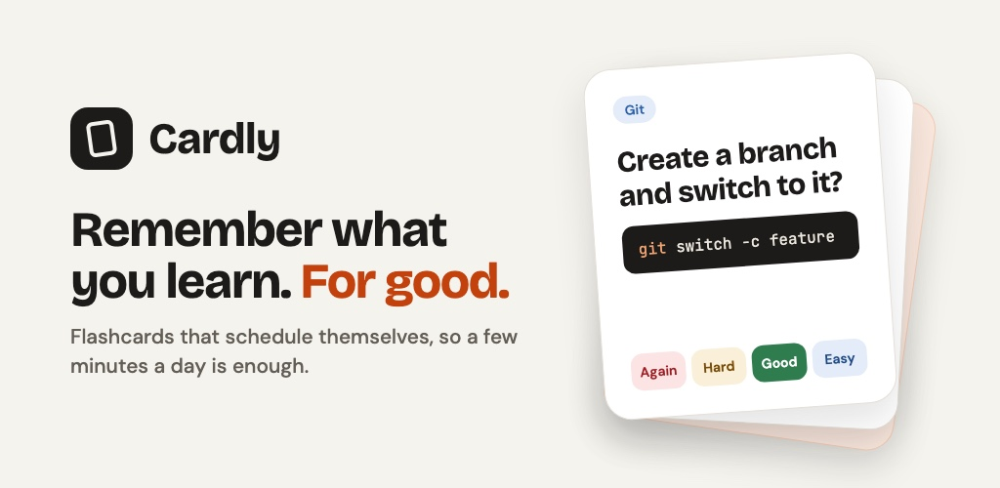

<div align="center">


# Cardly

**Flashcards that schedule themselves.**
Study a few minutes a day and remember what you learn, for good.

[](https://docs.expo.dev/versions/v57.0.0/)
[](https://reactnative.dev)
[](https://www.typescriptlang.org)
[](https://github.com/open-spaced-repetition/ts-fsrs)




</div>

---

## About

Cardly is a spaced-repetition flashcard app for Android and iOS. Each time you review a card
you rate how well you knew it, and Cardly works out the best day to show it again: just before
you would forget it. Scheduling uses **FSRS**, a modern open-source algorithm, so reviews stay
short and knowledge sticks.

It's built to be **private by design**: no account needed, no ads, no tracking. Your cards live
on your phone and work offline.

## Features

| | |
|---|---|
| 🧠 **Smart scheduling** | FSRS picks each card's next review; ratings show the exact interval (*Again · Hard · Good · Easy*) |
| 🃏 **Four card types** | Basic (with optional reverse), Cloze (hide words in a sentence), Code (syntax highlighted), Vocabulary (type the meaning) |
| 🚀 **Starter decks** | 12 ready-made decks (Git, Big-O, SQL, Spanish, hiragana, anatomy, capitals and more), suggested by your goals |
| 📥 **Import** | Anki decks (`.apkg`, old and new formats, **review history kept**) and CSV / tab-separated spreadsheets |
| 💾 **Backup & restore** | The whole library as one JSON file, restored all-or-nothing on any phone |
| 📅 **Exam mode** | Set an exam date per deck; Cardly tells you if you're on track and suggests a daily pace |
| 📊 **Progress** | Retention rate, 16-week study heatmap, 7-day forecast, streaks |
| 🔔 **Reminders** | A daily local notification, skipped on days you've already studied |
| 🌐 **English & Sinhala** | The full interface in English or සිංහල, with Noto Sans Sinhala typography |

## Tech stack

| Area | Choice |
|---|---|
| Framework | [Expo](https://expo.dev) SDK 57 · React Native 0.86 · React 19 · TypeScript |
| Navigation | [Expo Router](https://docs.expo.dev/router/introduction/) (file-based, typed routes) |
| Storage | [expo-sqlite](https://docs.expo.dev/versions/v57.0.0/sdk/sqlite/) with versioned migrations; settings in its key-value store |
| Scheduling | [ts-fsrs](https://github.com/open-spaced-repetition/ts-fsrs) |
| State | [Zustand](https://github.com/pmndrs/zustand) (persisted settings, study session) |
| Translations | [i18next](https://www.i18next.com), with type-checked keys |
| Import | [fflate](https://github.com/101arrowz/fflate) + [fzstd](https://github.com/101arrowz/fzstd) for Anki packages |
| Accounts *(off in v1)* | [Supabase Auth](https://supabase.com/docs/guides/auth): Google, Apple, email code |
| Builds & updates | [EAS Build](https://docs.expo.dev/build/introduction/), [EAS Update](https://docs.expo.dev/eas-update/introduction/) |
| Tests | Jest (`jest-expo`), SQLite tests on `node:sqlite` |

## Getting started

### Prerequisites

- [Node.js](https://nodejs.org) (current LTS) and npm
- The [Expo Go](https://expo.dev/go) app on your phone, for quick testing
- Optional: Android Studio (emulator) or Xcode (iOS Simulator) for development builds

### Install and run

```bash
git clone git@github.com:Bawanthathilan/recall.git
cd recall
npm install
cp .env.example .env.local   # optional: only needed for sign-in work
npm run start:go
```

Scan the QR code with your phone (Camera app on iPhone, or **Scan QR code** inside Expo Go on
Android). Your phone and computer need to be on the same Wi-Fi; if they aren't, use
`npm run start:tunnel`.

> [!NOTE]
> The project includes `expo-dev-client`, so plain `npx expo start` makes a QR code for a
> *development build*, not Expo Go. Use `npm run start:go` for Expo Go.

### Scripts

| Command | What it does |
|---|---|
| `npm run start:go` | Dev server for **Expo Go** |
| `npm run start:tunnel` | Same, through a tunnel (different networks, Google sign-in testing) |
| `npm start` | Dev server for a **development build** |
| `npm run android` / `npm run ios` | Build and run a development build locally |
| `npm run web` | Run in the browser |
| `npm test` | Unit tests |
| `npm run typecheck` | TypeScript check |
| `npm run lint` | ESLint |

### Environment variables

Copy `.env.example` to `.env.local` (git-ignored). Everything is optional; the app works fully
without them.

| Variable | Purpose |
|---|---|
| `EXPO_PUBLIC_SUPABASE_URL` | Supabase project URL (sign-in) |
| `EXPO_PUBLIC_SUPABASE_KEY` | Supabase publishable (anon) key |
| `EXPO_PUBLIC_ACCOUNTS` | `true` shows sign-in and the Account section. **Off in v1.0** |
| `EXPO_PUBLIC_APPLE_SIGN_IN` | `true` enables Sign in with Apple (needs the Apple Developer Program) |

## Project structure

```
src/
├── app/            # Screens (Expo Router: every file is a route)
│   ├── (tabs)/     #   Today · Decks · ＋ · Stats · Explore
│   ├── study/      #   Study session
│   ├── deck/ card/ #   Deck page, deck and card editors
│   └── …           #   onboarding, settings, import, sign-in
├── components/     # Shared UI (card faces, forms, charts, buttons)
├── db/             # SQLite schema + migrations, queries, backup, imports
├── lib/            # FSRS, note types, markup, Anki/CSV parsing, reminders, auth
├── i18n/           # en.ts (source of truth), si.ts, dates, language switch
├── data/           # Starter decks
├── store/          # Zustand stores
└── theme.ts        # Colours, fonts, spacing, text styles
plugins/            # Expo config plugins (iOS 27 scene life cycle)
scripts/            # Icon generator
store/              # Play Store listing, graphics, privacy policy site
```

## Development notes

- **Native folders are generated.** `android/` and `ios/` are created by `expo prebuild` and
  are git-ignored. Change native behaviour in `app.json` or a config plugin in `plugins/`, never
  by editing them.
- **Adding a package:** use `npx expo install <package>` so versions match the SDK. A package
  with native code needs a new development build (it won't run in Expo Go).
- **Translations:** add every new string to `src/i18n/en.ts` first, then the same key to
  `src/i18n/si.ts`. TypeScript rejects unknown keys, and the tests catch missing Sinhala strings
  and mismatched `{{placeholders}}`.
- **Database changes:** add a new entry to `MIGRATIONS` in `src/db/schema.ts`; never edit an
  existing one. Migrations are tested against a real SQLite database.
- **Before a pull request:** `npm run typecheck && npm run lint && npm test`.

## Building and releasing

Builds run in the cloud with [EAS](https://docs.expo.dev/eas/). Profiles are in `eas.json`.

```bash
npx eas-cli@latest build -p android --profile preview      # APK to install directly
npx eas-cli@latest build -p android --profile production   # AAB for Google Play
npx eas-cli@latest update --channel production             # over-the-air JavaScript update
```

Build numbers increase automatically. Over-the-air updates only reach builds with the same
native code (the runtime version is a fingerprint of it); anything that adds native code needs a
new store build.

Store listing text, Data safety answers, graphics and the privacy policy page are in
[`store/`](store/listing.md).

## Roadmap

Android is released first; iOS follows. See [ROADMAP.md](ROADMAP.md) for the full plan and
what's done.

## License

See [LICENSE](LICENSE).
